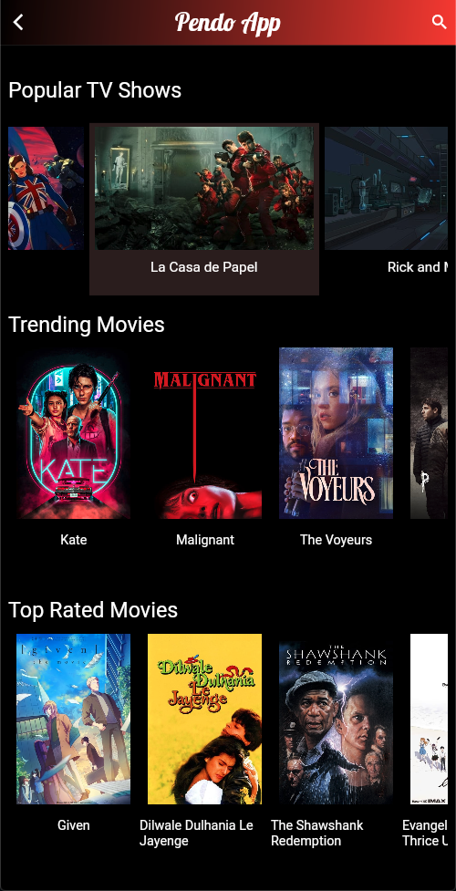
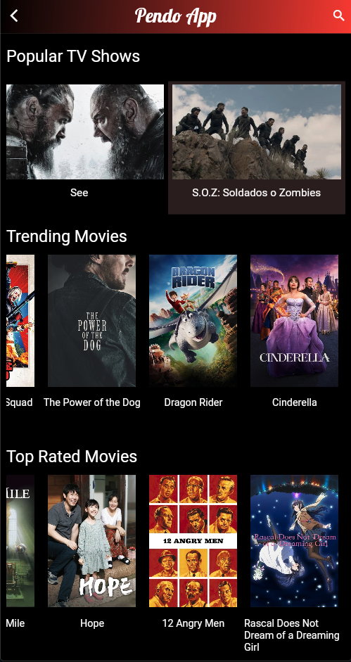

Important:
    -There is a zip file named build.zip, it is very important to unzip it in the folder app.
## Technologies and Components Used
- Navigation Search
- Async Task
- TMDB API
- POSTMAN API Platform
- Android Studio
- Flutter
- Dart
- GoogleFonts
- Hover Animation

## What I learned
- It was my first time to work with Dart language and Flutter.
- Flutter helped me to paint my app to life in milliseconds with Stateful Hot Reload,
- Quickly ship features with a focus on native end-user experiences with expressive and flexible designs.
- At the beginning I face some difficulties with the search button functionality, but like always, I make it work!.
- It was so exciting to learn these new technologies with Android Studio.

### Built with
- [Flutter](https://flutter.dev/docs)
- [Dart](https://dart.dev/guides)
- [TMDB API](https://developers.themoviedb.org/3/getting-started/introduction)
- [POSTMAN](https://www.postman.com)

